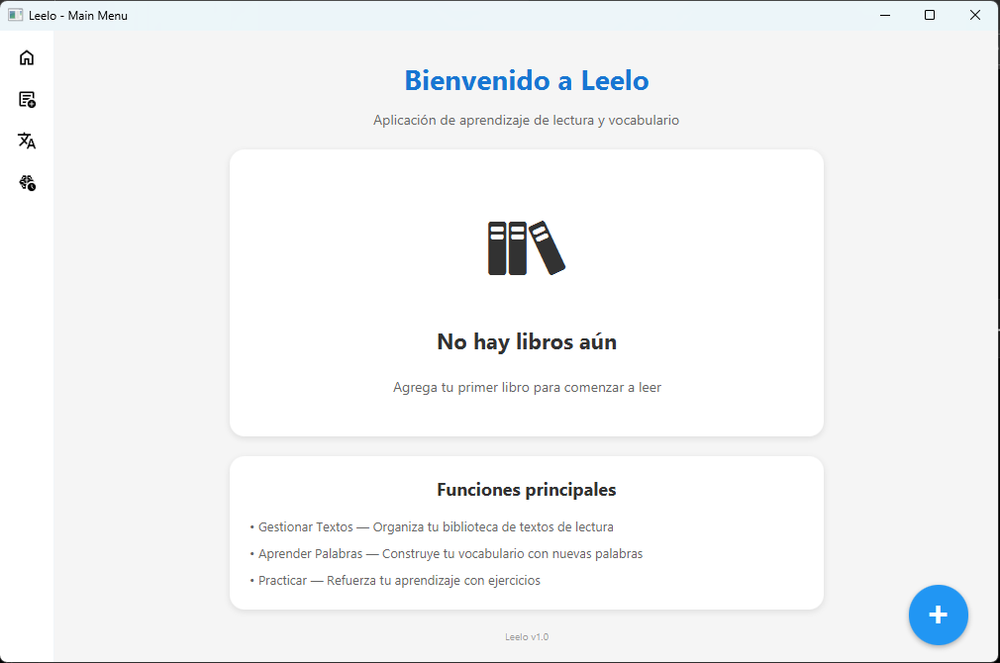
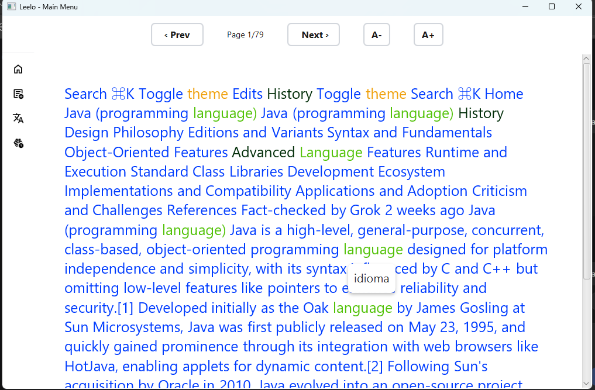
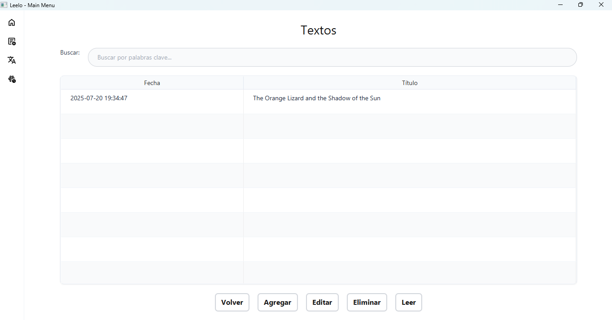
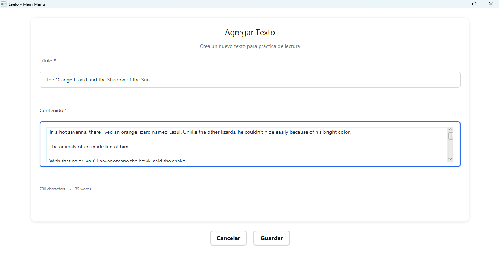

# 📚 Leelo - Reading and Learning Application

A desktop application developed in JavaFX to improve reading skills and language learning.







## 🚀 Features

- **Text management**: Add and organize texts for reading
- **Word management**: Create word lists for study
- **Interactive practice**: Exercises to improve comprehension
- **SQLite database**: Local data storage
- **Modern interface**: Clean and easy-to-use design

## 📋 Requirements

- **Java 21** or higher
- **Apache Maven 3.6+**

## 🛠️ Installation and Usage

### For Developers

1. **Clone the repository**
   ```bash
   git clone <repository-url>
   cd leelo
   ```

2. **Compile the project**
   ```bash
   mvn clean package
   ```

3. **Run in development mode**
   ```bash
   mvn javafx:run
   ```
### For End Users

1. **Download the application**
   - leelo-0.1.0-shaded.jar

2. **Run the application**
   - **Manual**: `java -jar Leelo.jar`
   - **Open**: `leelo-0.1.0-shaded.jar`

## 📁 Project Structure

```
leelo/
├── src/
│   ├── main/
│   │   ├── java/com/leelo/
│   │   │   ├── controller/     # JavaFX controllers
│   │   │   ├── dao/           # Data access objects
│   │   │   ├── model/         # Data models
│   │   │   ├── service/       # Business logic
│   │   │   └── App.java       # Main class
│   │   └── resources/
│   │       └── com/leelo/
│   │           ├── *.fxml     # Interface files
│   │           └── icons/     # Application icons
├── target/
│   ├── Leelo.jar              # Executable JAR
│   └── leelo-0.1.0-shaded.jar # Windows execution script
├── target/
│   └── leelo-1.0.0-executable.jar  # JAR with dependencies
└── pom.xml                   # Maven configuration
```

## 🔧 Useful Commands

### Development
```bash
# Compile and run
mvn clean javafx:run

# Compile only
mvn clean compile

# Create executable JAR
mvn clean package
```

### Distribution
```bash
# Create JAR for distribution
mvn clean package

# The executable JAR will be at:
# target/leelo-1.0.0-executable.jar
```

### End User Requirements
- Java 21 or higher installed

## 📄 License

This project is under the [MIT license] license.

---

**Developed with ❤️** 