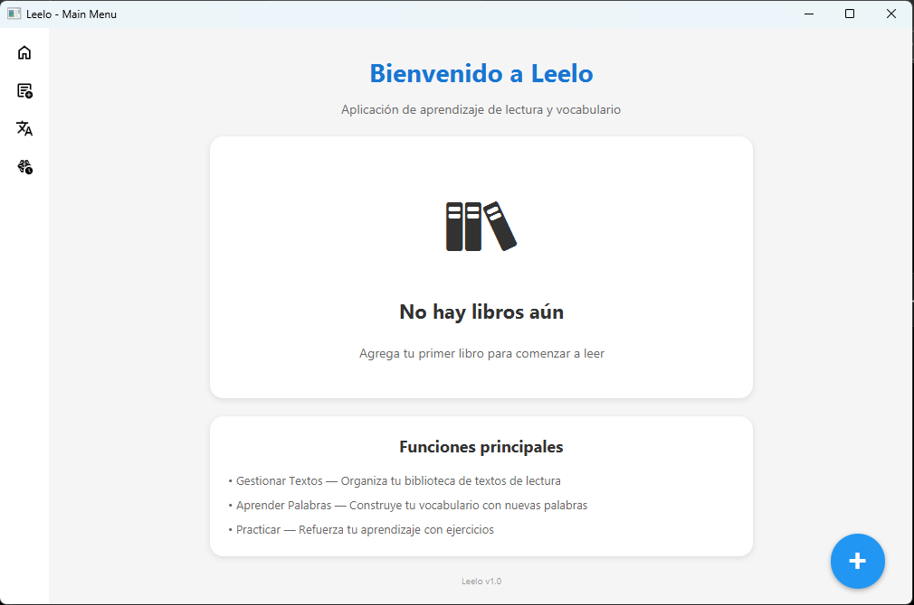
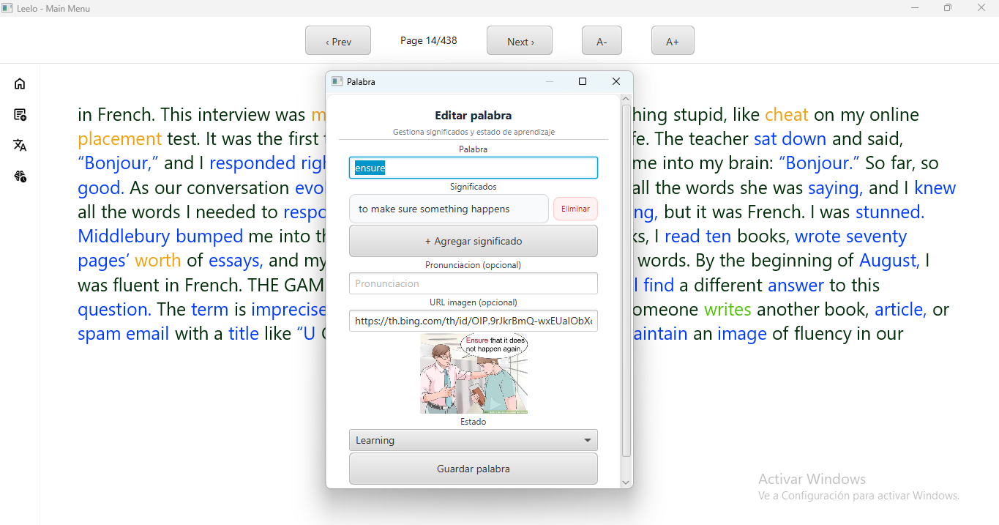
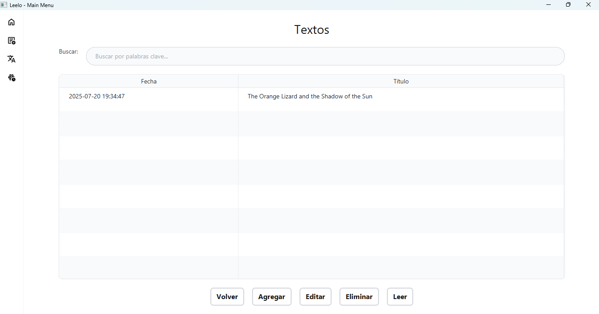
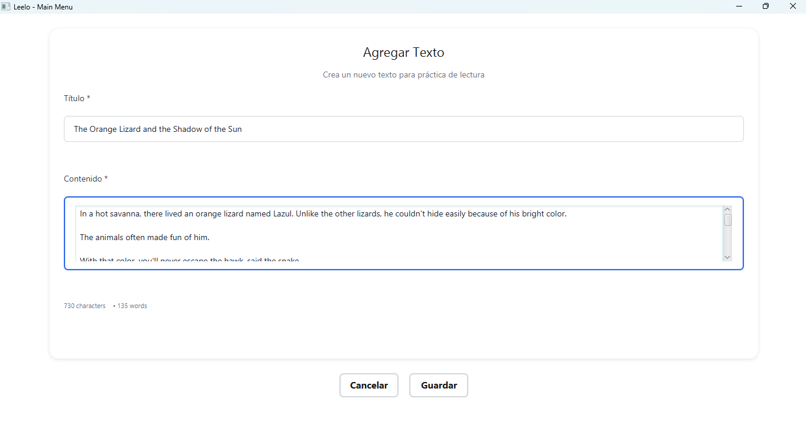

# Leelo – Reading Application to Track Vocabulary

A desktop application to improve reading skills and language learning.








## For Developers

## Requirements

- **Java 21** or higher
- **Apache Maven 3.6+**

## 🛠️ Installation and Usage

1. **Clone the repository**
   ```bash
   git clone <repository-url>
   cd leelo
   ```

2. **Compile the project** : This command will create the installer
   ```bash
   mvn clean package
   ```
 
3. **Run in development mode**
   ```bash
   mvn javafx:run
   ```

## For End Users

1. **Download the instaler Leelo-0.1.2.exe for windows **
   - Leelo-0.1.2.exe


##  License

This project is under the [MIT license] license.